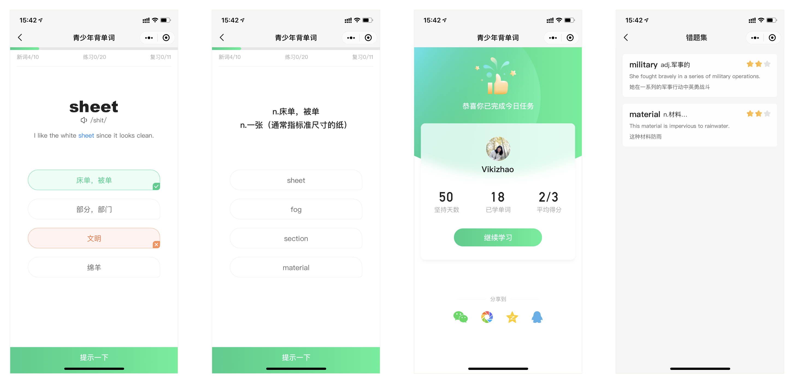
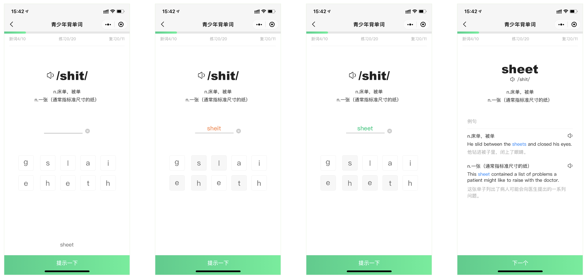

## **单词大作战**

### 小程序简介

**单词大作战**，不服你来啊！

作为一款寓学于乐、学与练结合的英语单词学习产品，打造了**实时单词对战**功能，**选择和拼写练习**功能，为了让单词深深印在你的脑海中！本产品单词内容丰富、释义和例句详实，并包含大量地道的用法和短语，满足不断深入学习的你！

同时，
提供了错题集，可以温故而知新；
提供了历史得分，可以随时查看个人的学习效果；
提供了学习记录，可以随时掌握个人的学习进度和时间安排；
提供了学习计划设置，可以随着个人水平的提升更新单词本内容和计划；

**单词大作战**，年轻人背单词的首选，为爱学习的你提供一臂之力！

### 功能模块介绍

**定制你的专属计划**

产品包含丰富的单词学习功能，每次学习都有记录，并且可以定制自己的专属计划。
学习、练习、对战娱乐...，学习娱乐一样不耽误。

**实时对战功能**

寓学于乐，实时对战！
一个人的学习总会变得boring，约上小伙伴一起吧，来几局双人对战，让英语学习变得更有意思！

**丰富的释义和例句**

具备非常丰富的释义，包括单词的各种词性和中文解释，以及各释义下的多个例句。
同时包含丰富的短语和地道的英语用法，让你透彻地了解单词的各种含义。

**练和学的结合**

学习单词之后，紧接着就可以练习，通过多种题型的练习，进一步巩固内容。
并且包含错题集，再现历史学习得分低的单词，可以循环往复学习加深印象！

**单词拼写练习**

对于很多阅读认识、拼写不会的单词，本功能绝对是你的救星，通过不断的拼写练习，加深记忆。

路在脚下，学习是需要持续的，坚持就是胜利✌️

### 体验二维码

源码链接
https://github.com/aaronren/EnglishLearning

### 演示视频
<video id="video" controls="" preload="none" poster="./images/cover.jpg">
<source id="mp4" src="./images/realshow.mp4" type="video/mp4">
</video>

## 历史版本

少儿每日英语

帮忙少儿背单词，提高单词量的小工具！

### 产品功能设计

1. 提醒功能
   在一次学习完成时触发，弹出提醒设置页，默认给出提醒时间。如果两次提交都是同一个时间，如半小时内，则云数据库不做插入，否则只要提醒时间不同，都做插入。
   云后台根据提醒时间下发。

2. 单词学习

### 版本记录

\- v1.0
\- 本地单词库，简易简单信息
\- 练习三项，看词选义，听音选义，单词拼写
\- 单词练习结果展示
\- 仅含调整单词数的设置
\- 首页 天数、已学单词数、平均得分 三套件
\- aladin无痕埋点

\- v1.1
\- 单词丰富含例句、云端，本地列表
\- 登录页面和登录流程
\- 图片瘦身
\- 设置页面丰富，但单词书切换

\- v1.1.1（撤回，改提1.1.2）
\- 默认头像底图不显示问题，在线头像
\- 步骤的UI？移除步骤条，简化和优化UI
\- 坚持天数跳转enroll
\- timeRecord的完成记录显示错误问题
\- 5处出错的监控
\- 移除aladin改为mta

\- v1.1.2
\- event.js中一处可能crash的修复

\- v1.2
\- 增加错题本功能；
\- 支持单词页面的用户反馈；
\- 拼写输入框的UI颜色调整；

\- v1.2.1（优化索引） >2020.7.18
\- dailyWords页面无需前置页面也能打开显示（单词默认）
\- sitemap.json中填写描述

\- v1.3.0 >2020.11.12
\- 增加提醒功能，原学习后的查看成绩改为明日提醒

\- v1.3.1 >2020.11.15
\- 解决提醒时间不准的问题：
\- 1.时间完全由服务器决定，当前时间加24小时；
\- 2.一小时内不重复插入通知；
\- 3.更换了通知模版，不强调时间；
\- 4.订阅提醒的按钮依然按半小时间隔显示；
\- 5.服务端触发器改为10分钟一次。

\- v1.4.0 >2020.11.19
\- 增加tipBar组件，用于提示功能

\- v1.4.1 >2020.11.20
\- fix 已学单词列表的滑动问题

\- v1.5.0 >2020.12.2（审核撤回，未上线）
\- 首页实现单词搜索功能！
\- enroll页面改为组件方式，提升复用性

\- v1.5.1 >2020.12.3
\- 修复搜索输入匹配问题，单词大写、两侧空格都可以匹配

\- v1.6.0 >2020.1.29
\- 改写拼写练习的整体UI，制作简单键盘

\- v1.6.1 >2020.1.31
\- 修复拼写练习的bug